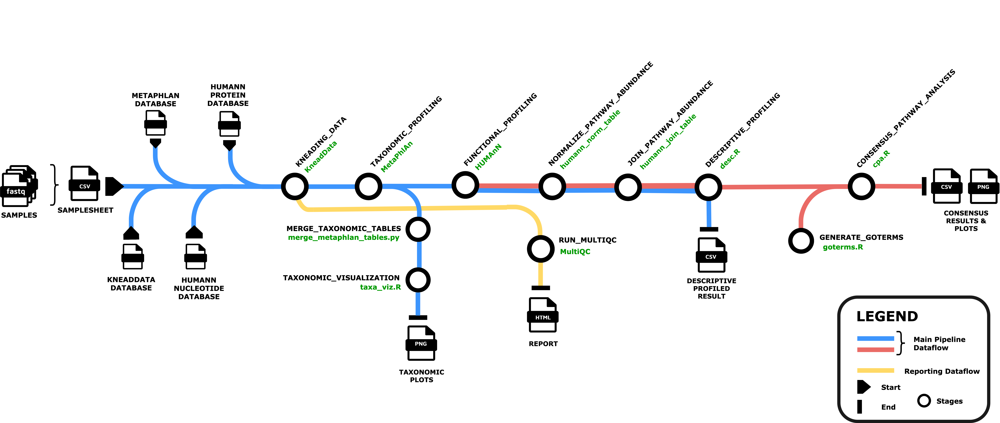

# EPSCoR NASA Special Project: Pathway-level, consensus analysis of microbiome profiling data

## Introduction

## Pipeline Summary



## Dataset

### Data 1

Download the data from [**Open Science Data Repository (OSDR)**](https://www.nasa.gov/osdr/). We are currently using the [_OSD-809_](https://osdr.nasa.gov/bio/repo/data/studies/OSD-809) dataset.
Description: Effects of an anaerobic membrance bioreactor upset event on nitrogen speciation and microbial community in a downstream phototrophic membrane bioreactor.

* Factors: 'Time'
* Assay: Metagenomic sequencing - Whole Genome Shotgun Sequencing - Illumina Nextera Kit
* Device Platform: Illumina
* Samples: 12
* Sample Type: Paired-end

### Data 2

Download the data from [**SRA**](https://www.ncbi.nlm.nih.gov/sra?linkname=bioproject_sra_all&from_uid=779554).

_BioProject_: PRJNA779554
Description: Metagenomic analysis of Rhizosphere soil. 
Publication: "A framework for the targeted recruitment of crop-beneficial soil taxa based on network analysis of metagenomic data." doi: 10.1186/s40168-022-01438-1

* Assay: Shotgun Metagenome Sequencing (WGS)
* Device Platform: Illumina NovaSeq 6000
* Samples: 30
* Sample Type: Paired-end

## Usage

1. Install Nextflow on your system. Please follow the installation guide [_here_](https://nextflow.io/docs/latest/install.html).
2. Download the datasets or choose your own dataset.
3. Create a samplesheet in CSV format. Below are two examples of how the samplesheet should look like:
  
  Example 1: For dataset with factor (condition) information.

  ```
  sample,factor,fastq_1,fastq_2
  SAMPLE1-ID,NN,sample1_R1.fastq.gz,sample1_R2.fastq.gz
  SAMPLE2-ID,NN,sample2_R1.fastq.gz,sample2_R2.fastq.gz
  SAMPLE3-ID,NN,sample3_R1.fastq.gz,sample3_R2.fastq.gz
  ```

  Example 2: For dataset without factor (condition) information.

  ```
  sample,fastq_1,fastq_2
  SAMPLE1-ID,sample1_R1.fastq.gz,sample1_R2.fastq.gz
  SAMPLE2-ID,sample2_R1.fastq.gz,sample2_R2.fastq.gz
  SAMPLE3-ID,sample3_R1.fastq.gz,sample3_R2.fastq.gz
  ```

4. Run the command below to execute the pipeline.

  ```

nextflow main.nf \\
            -profile <PROFILE> \\
            --samplesheet path/to/INPUT.csv \\
            --output /path/to/OUTPUT_DIR \\
            --kneaddata_db_path /path/to/folder/kneaddata/database/download/ \\
            --kneaddata_db REFERENCE_DB:BUILD \\
            --metaphlan_db_path /path/to/folder/metaphlan/database/download \\
            --humann_nucleotide_db NUCLEOTIDE_DB:BUILD \\
            --humann_nuc_db_path /path/to/folder/humann/nucleotide/databases/download \\
            --humann_protein_db PROTEIN_DB:BUILD \\
            --humann_prot_db_path /path/to/folder/humann/protein/databases/download \\
            --humann_pathway_db PATHWAY_DB

```

### Parameter options

* `-profile` : Specify the profile to use for running the pipeline in local or on the HPC.
    This can be set to the following:
    1. _local_ ( To run the pipeline on local machine, uses separate conda environment for each process )
    2. _cluster_ ( To run the pipeline on HPC, uses separate conda container for each process )

* `--samplesheet` : Path to a CSV file where each row specifies the sample name and the file paths to paired-end FASTQ files (R1 and R2), separated by commas.

* `--output` : Path to the output directory where results will be saved.

* `--kneaddata_db_path` : Path to saved or where to save kneaddata databases (default: ./kneaddata_db/)

* `--kneaddata_db` : Comma seperated list with no spaces of databases for kneadata to use in database:build format  (default: human_transcriptome:bowtie2,ribosomal_RNA:bowtie2)

    Possible options:
        - human_transcriptome:bowtie2
        - ribosomal_RNA:bowtie2
        - mouse_C57BL:bowtie2
        - dog_genome:bowtie2
        - cat_genome:bowtie2
        - human_genome:bmtagger

    There currently is a bug in the current *kneaddata v0.12.2* release of kneaddata for human_genome:bowtie2. This will be fixed in _0.12.3_. You can manually create the *"human_genome_bowtie2"* directory and manually download the correct file here 
    `https://huttenhower.sph.harvard.edu/kneadData_databases/Homo_sapiens_hg39_T2T_Bowtie2_v0.1.tar.gz` and extract it into the *kneaddata_path/human_genome_bowtie2* directory. The within that directory run the following command: touch `.done`

* `--metaphlan_db_path` : Path to the directory where metaphlan databases are saved or will be downloaded (default: ./metaphlan_db/)

* `--humann_nucleotide_db` : Comma separated list with no spaces of nucleotide databases for humann to use in database:build format (default: chocophlan:full)
    Possible options:
        - chocophlan:full

* `--humann_nuc_db_path` : Path to the directory where humann nucleotide database is saved or will be downloaded (default: ./humann_nucdb/)

* `--humann_protein_db` : Comma separated list with no spaces of protein databases for humann to use in database:build format (default: uniref:uniref50_diamond)

    Possible options:
        - uniref:uniref50_diamond
        - uniref:uniref90_diamond
        - uniref:uniref50_ec_filtered_diamond
        - uniref:uniref90_ec_filtered_diamond

* `--humann_prot_db_path` : Path to the directory where humann protein database is saved or will be downloaded (default: ./humann_protdb/)

* `--humann_pathway_db` : Specify the database to use for pathway {metacyc, unipathways} computations (default: metacyc)

## Reporting

## Pipeline Output

## Credits

## Contribution and Support

## Citations
